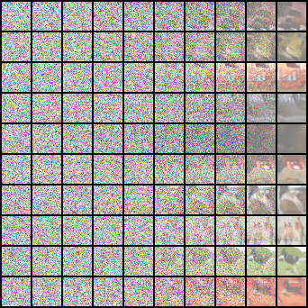

### Demonstration of Denoising Diffusion Probabilistic Models (DDPM) with PyTorch

This notebook demonstrates the re-implementation, with my interpretation, and training of Denoising Diffusion Probabilistic Models (DDPM) using PyTorch. The model is trained on the CIFAR-10 dataset to generate high-quality images.

Original paper: [Denoising Diffusion Probabilistic Models](https://arxiv.org/abs/2006.11239) by Ho et al., 2020.

## Steps
1. Mount Google Drive and Install dependencies.
2. Check GPU availability.
3. Prepare the Train/Test dataset using CIFAR-10.
4. Load the Unet model and diffusion model.
5. Train the diffusion model.
6. Evaluate sample quality using FID score.
7. Save and Display generated samples.

## Sample Generated Image

## Limitations
- Requires extensive compute resources.
- High memory consumption due to parameter-heavy models.
- Each epoch is about 2GB memory and 800K steps takes 4100 epochs, which amounts to 8TB, unavailble in google drive storage.
- Training time can be long (10 hrs on A100 GPU).
- FID evaluation time can be long about 4hrs for 50K samples on A100 GPU.
- Need to adjust step size and samples for FID evaluation based on available resources.

## Potential Improvements
- Increasing the target steps and num_samples for FID evaluation have proven to yield significantly better results.
- For conditional generation, consider using classifier-free guidance for improved sample quality.
- Experiment with different architectures for the Unet model or even try flash attention.
